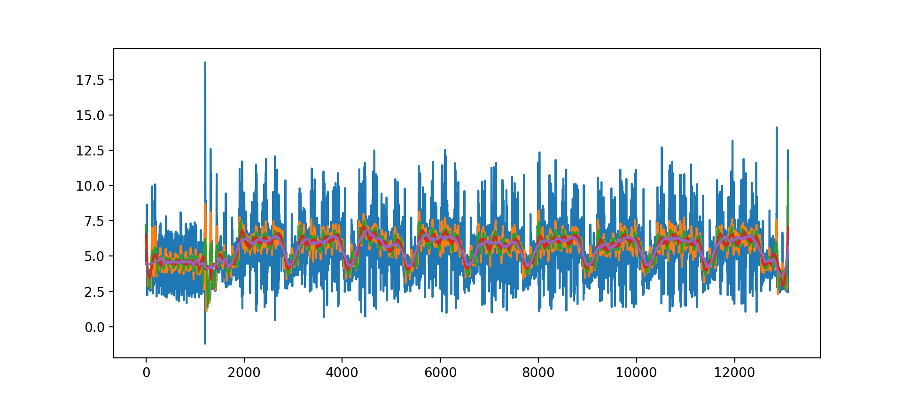
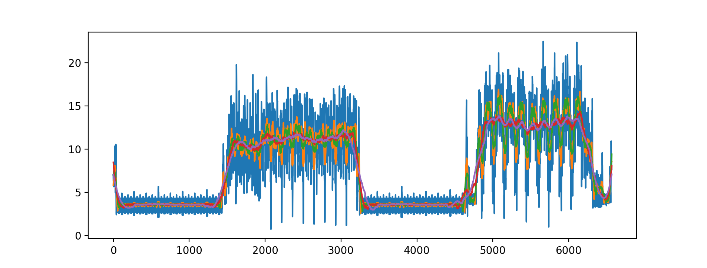

emusca - Power trace simulator using Unicorn Engine
========================

This project uses [Unicorn] to emulate a binary. Every instruction is traced
and the hamming distance between every register before and after the instruction
is calculated and stored. The target binary is run over many input ciphertexts (or plaintexts)
to generate simulated power traces (simply the hamming distance for now) and [Daredevil] input,
output, trace, and config file are generated. Marker functions consisting of NOPs are added to the
target binary and the instruction hook records when they are hit. This is to facilitate finding
the boundaries of the rounds of AES. [deco] is used for easy multiprocessing to speed up trace generation.

Example Traces
--------------
AES S-Box based implementation simulated power trace.
The different colored plots are the same trace smoothed at different levels.
The nine humps are the inner full rounds of AES.

AES T-Table based implementation simulated power trace.
The plateau on the right hand side are the rounds of AES. They are more difficult to distinguish compared
to the S-Box trace since they take approximately 10 times fewer instructions per round.

The activity on the left hand side in both plots is key expansion.

Other Notes
------------
Before I realized the `MBEDTLS_AES_ROM_TABLES` option existed for mbedTLS, I was frustrated by
the time wasted on generating the AES tables for every trace emulation. Thus I wrote a hacky save/restore
system for Unicorn that runs a dummy encryption to make sure the tables are initialized, dumps the mapped
memory to a global cache and then uses that global cache when creating the Unicorn instances for
each trace simulation. I thought it might be useful later so I left it in. Registers are not saved/restored
but could be thanks to the save/restore context API that the [angr] project got upstreamed to Unicorn.

LIEF is used to map the ELF binary into Unicorn and to find various symbols for marker tracing and crypto input/output setting/getting.

This may be rewritten in C++ in the future to see if that appreciably improves the performance. The Python version will always exist since it is so easy to hack on.

Build/Run notes:
-----------
The ARM build assumes an NXP toolchain is present. I need to switch to using devkitARM or something easier to install.

This needs my [jevmaster branch of unicorn] for the batch register read Python bindings. Remind me to create a PR for Unicorn to upstream this.

TODO
------------
Write up tutorial for building, collecting traces, and running CPA on them.

Lots of code cleanup.

[Unicorn]: https://github.com/unicorn-engine/unicorn
[Daredevil]: https://github.com/SideChannelMarvels/Daredevil
[deco]: https://www.peterbe.com/plog/deco
[LIEF]: https://lief.quarkslab.com
[angr]: http://angr.io
[jevmaster branch of unicorn]: https://github.com/jevinskie/unicorn/tree/jevmaster
